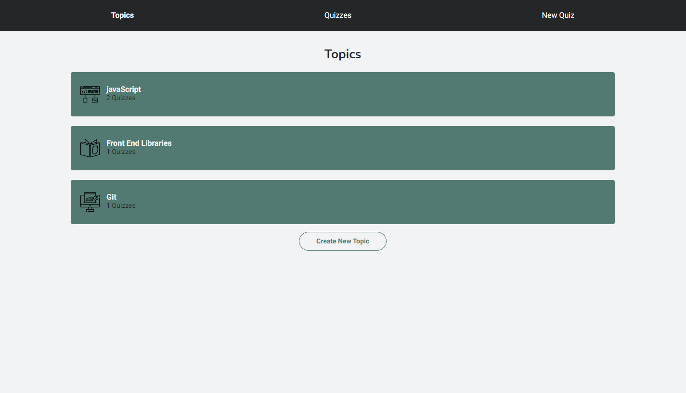
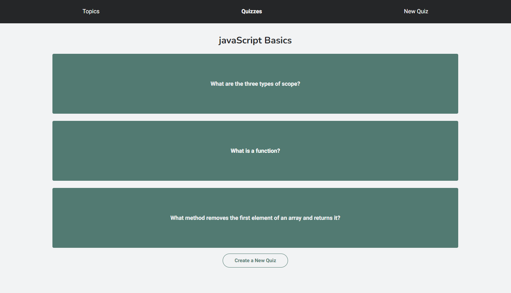

# React Redux Flashcards

This project is part of Codecademy's Front-End Engineer Path.

## Description

In this project, I used Redux and Redux Toolkit to manage the complex state of a flashcard-style quiz app. Users are able to create their own topics, quizzes for those topics, and flashcards for those quizzes. Users will also be able to interact with their quizzes by flipping flashcards over.

## Built With

## Snapshot

## Link

## Credits

Favicon:
[Mansha Graphics](https://www.flaticon.com/authors/manshagraphics)

## License

Licensed under the MIT license.

## Questions

[Email Me](Chloe.a.harris17@gmail.com) if you have any questions.

Check out more of my work on [GitHub](https://github.com/chloeharris1).
